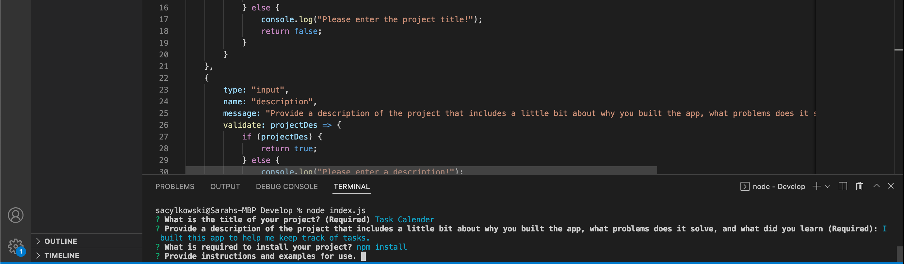

# Professional README Generator

  ## Description
  This is a command line program that helps you write a professional README.  It will ask for the title of the program, a description, how to install it, how to use it, how to contribute, how to test, and a questions section.  It will also ask for a license if it was used.

  ## Installation
  To install required dependecies, run the following command:
  npm install

  ## Usage
  This app is simple to use.  You fill out the prompts appropriately and the README is then generated.
  

  ## Questions
  If you have any questions, please reach out on <a href="https://github.com/sacylkowski/">GitHub</a> or you can <a href="mailto:sacylkowski@gmail.com">E-mail me</a>.
